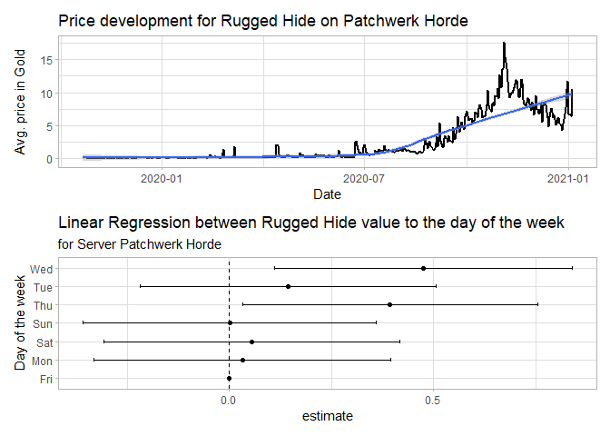

<!-- README.md is generated from README.Rmd. Please edit that file -->

# nexminer

<!-- badges: start -->

<!-- badges: end -->

<https://nexushub.co/> provides and
[API](https://nexushub.co/developers/api/General/foo) to data mine
several prices of in game items of the video game World of Warcraft
Classic. The following tool simplifies R users to import the data or
loop over several items. Please be reminded that all data is collected
by the nexushub team and their development page can be visited
[here](https://github.com/nexus-devs/wow-classic-items).

## Install

``` r
devtools::install_github("gstephan30/nexminer")
```

## Example

The following examples show how to import price trends of [Black
Lotus](https://classic.wowhead.com/item=13468) or [Rugged
Hide](https://classic.wowhead.com/item=8171)on the EU server Patchwerk
Faction Horde:

``` r
library(nexminer)
library(patchwork)

server <- "patchwerk"
fraction <- "horde"

rh_raw <- import_item("rugged hide", server, fraction)
rh_clean <- clean_json(rh_raw)
p1 <- smooth_item(rh_clean)
p2 <- lm_item_wday(rh_clean)

p1 / p2
```



``` r
bl_raw <- import_item("Black LOTus", server, fraction)
bl_clean <- clean_json(bl_raw)
p3 <- smooth_item(bl_clean)
p4 <- lm_item_wday(bl_clean)

p3 / p4
```


Or just loop over multiple items:

``` r
library(dplyr)
library(purrr)

flasks <- c("Flask of the Titans", "Flask of Distilled Wisdom", 
            "Flask of Supreme Power", "Flask of Chromatic Resistance",
            "Flask of Petrification")

flasks_df <- flasks %>%
  map_df(function (x)
    import_item(x, server, fraction) %>% 
      clean_json()
    )

# count of times where flasks are captured
flasks_df %>% 
  count(item, sort = TRUE)
#> # A tibble: 5 x 2
#>   item                              n
#>   <chr>                         <int>
#> 1 Flask of the Titans            6085
#> 2 Flask of Supreme Power         6074
#> 3 Flask of Distilled Wisdom      5933
#> 4 Flask of Petrification          480
#> 5 Flask of Chromatic Resistance   420

flasks_df %>% 
  group_split(item) %>% 
  map(smooth_item) %>% 
  wrap_plots(ncol = 1)
```


